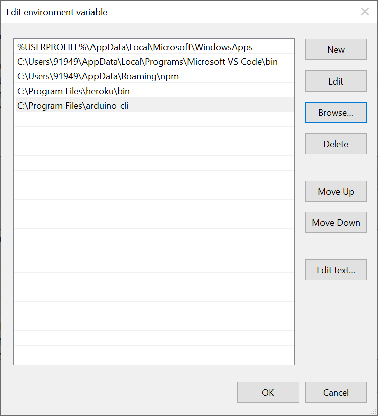
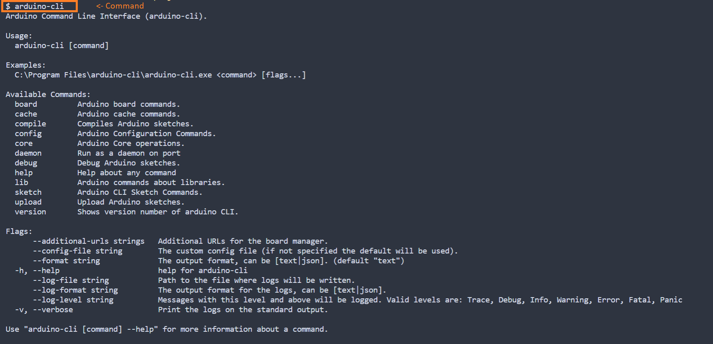

# Using Arduino CLI on windows 10

## Install the cli

1. Download the cli tool from [here](https://arduino.github.io/arduino-cli/installation/)

2. Extract the `arduino-cli.exe` file to a folder which is indexed in `PATH`.

- Either you can move the `arduino-cli.exe` to `C:\Windows\System32`

  **or**

- add the `arduino-cli.exe` path to system variable.

- I crated a folder: `C:\Program Files\arduino-cli`, and added it into my path variable.

- follow [this](https://stackoverflow.com/questions/44272416/how-to-add-a-folder-to-path-environment-variable-in-windows-10-with-screensho) link if need help in adding folder to system variable.
  

## Check the installation

- Check if the `arduino-cli` is accessible from terminal by typing:
  `arduino-cli`.

- You should get an output similar to this:
  

- If everything is working, update the local cache of available platforms and libraries by running:
  `arduino-cli core update-index`

## Create a new sketch

New sketch can be created in current folder by the command:
`arduino-cli sketch new MyFirstSketch`

eg:

> \$ arduino-cli sketch new cli-blink
> Sketch created in: C:\projects\cli-blink

A folder with `.ino` file will be create for you.

You can open this file in you favorite IDE or text editor.

## See the connected board

- Connect the board to your PC and run the command to see the list of board attached to it.

`arduino-cli board list`

> \$ arduino-cli board list
> Port Type Board Name FQBN Core
> /dev/ttyACM1 Serial Port (USB) Arduino/Genuino MKR1000 arduino:samd:mkr1000 arduino:samd

## Compile and upload the sketch

Once you open the code in your favorite Editor, Add you code to the `.ino` file

```cpp
void setup() {
    pinMode(LED_BUILTIN, OUTPUT);
}

void loop() {
    digitalWrite(LED_BUILTIN, HIGH);
    delay(1000);
    digitalWrite(LED_BUILTIN, LOW);
    delay(1000);
}
```

### Compile the sketch

Run the following command to compile the sketch

`arduino-cli compile --fqbn YourBoardFQBN YourSketchName`

- Here the `FQBN` stands for **Fully Qualified board name**, which is used to denote a particular board.

- for example `arduino:avr:nano` is the `fqbn` for `Arduino Nano`,
  and arduino:avr:uno for `Uno` boards

- To compile sketch called `cli-blink` for `Arduino Nano` run the following command.

`arduino-cli compile --fqbn arduino:avr:nano cli-blink`

and you will get output like

> \$ arduino-cli compile --fqbn arduino:avr:nano cli-blink
> Sketch uses 924 bytes (3%) of program storage space. Maximum is 30720 bytes.
> Global variables use 9 bytes (0%) of dynamic memory, leaving 2039 bytes for local variables. Maximum is 2048 bytes.

- If you get any error like

  > Error during build: platform not installed

  Then run the command: `arduino-cli core install arduino:avr`, which will install missing platform.

- To list all the supported boards and its FQBN in you machine use command:

`arduino-cli board listall`

> \$ arduino-cli board listall
> Board Name FQBN
> 4D Systems gen4 IoD Range esp8266:esp8266:gen4iod
> ATtiny13 MicroCore:avr:attiny13
> Adafruit Circuit Playground arduino:avr:circuitplay32u4cat
> Adafruit Feather HUZZAH ESP8266 esp8266:esp8266:huzzah
> Amperka WiFi Slot esp8266:esp8266:wifi_slot
> Arduino esp8266:esp8266:arduino-esp8266
> Arduino BT arduino:avr:bt
> Arduino Duemilanove or Diecimila arduino:avr:diecimila
> Arduino Esplora arduino:avr:esplora
> Arduino Ethernet arduino:avr:ethernet
> Arduino Fio arduino:avr:fio
> Arduino Gemma arduino:avr:gemma
> Arduino Industrial 101 arduino:avr:chiwawa
> Arduino Leonardo arduino:avr:leonardo
> Arduino Leonardo ETH arduino:avr:leonardoeth
> Arduino Mega ADK arduino:avr:megaADK
> Arduino Mega or Mega 2560 arduino:avr:mega
> Arduino Micro arduino:avr:micro
> Arduino Mini arduino:avr:mini
> Arduino NG or older arduino:avr:atmegang
> Arduino Nano arduino:avr:nano
> Arduino Nano Every arduino:megaavr:nona4809
> Arduino Pro or Pro Mini arduino:avr:pro
> Arduino Robot Control arduino:avr:robotControl
> Arduino Robot Motor arduino:avr:robotMotor
> Arduino Uno arduino:avr:uno
> Arduino Uno WiFi arduino:avr:unowifi
> Arduino Uno WiFi Rev2 arduino:megaavr:uno2018
> Arduino Yún arduino:avr:yun
> Arduino Yún Mini arduino:avr:yunmini
> DOIT ESP-Mx DevKit (ESP8285) esp8266:esp8266:espmxdevkit
> Digistump Oak esp8266:esp8266:oak
> ESPDuino (ESP-13 Module) esp8266:esp8266:espduino
> ESPectro Core esp8266:esp8266:espectro
> ESPino (ESP-12 Module) esp8266:esp8266:espino
> ESPresso Lite 1.0 esp8266:esp8266:espresso_lite_v1
> ESPresso Lite 2.0 esp8266:esp8266:espresso_lite_v2
> Generic ESP8266 Module esp8266:esp8266:generic
> Generic ESP8285 Module esp8266:esp8266:esp8285
> ITEAD Sonoff esp8266:esp8266:sonoff
> Invent One esp8266:esp8266:inventone
> LOLIN(WEMOS) D1 R2 & mini esp8266:esp8266:d1_mini
> LOLIN(WEMOS) D1 mini Lite esp8266:esp8266:d1_mini_lite
> LOLIN(WEMOS) D1 mini Pro esp8266:esp8266:d1_mini_pro
> LilyPad Arduino arduino:avr:lilypad
> LilyPad Arduino USB arduino:avr:LilyPadUSB
> Linino One arduino:avr:one
> NodeMCU 0.9 (ESP-12 Module) esp8266:esp8266:nodemcu
> NodeMCU 1.0 (ESP-12E Module) esp8266:esp8266:nodemcuv2
> Olimex MOD-WIFI-ESP8266(-DEV) esp8266:esp8266:modwifi
> Phoenix 1.0 esp8266:esp8266:phoenix_v1
> Phoenix 2.0 esp8266:esp8266:phoenix_v2
> Seeed Wio Link esp8266:esp8266:wiolink
> SparkFun Blynk Board esp8266:esp8266:blynk
> SparkFun ESP8266 Thing esp8266:esp8266:thing
> SparkFun ESP8266 Thing Dev esp8266:esp8266:thingdev
> SweetPea ESP-210 esp8266:esp8266:esp210
> ThaiEasyElec's ESPino esp8266:esp8266:espinotee
> WeMos D1 R1 esp8266:esp8266:d1
> WiFiduino esp8266:esp8266:wifiduino
> WifInfo esp8266:esp8266:wifinfo
> XinaBox CW01 esp8266:esp8266:cw01

### Upload the sketch

- Use the command:
  `arduino-cli upload -p YourBoardPort --fqbn YourBoardFQBN YourSketchName`

- To compile sketch called `cli-blink` for `Arduino Nano` connected in Port `COM3` run the following command:

  `arduino-cli upload -p COM3 --fqbn arduino:avr:nano cli-blink`

## Install 3rd party cores.

- You can use `arduino-cli` to compile and upload code to non AVR boards as well such as `ESP8266` and `ESP32`.

- For this, we need to add the additional package indexes in the Arduino CLI configuration file.

- Create a configuration file if it doesn't exist by the command:
  `arduino-cli config init`

> \$ arduino-cli config init
> Config file written to: C:\Users\B45i\AppData\Local\Arduino15\arduino-cli.yaml

- Open the configuration file in any editor and add new board manger url to `board_manager > additional_urls`.

- To add ESP8266 with URL: `https://arduino.esp8266.com/stable/package_esp8266com_index.json`,
  Edit the `yaml` file like this:

```yaml
board_manager:
  additional_urls:
    [https://arduino.esp8266.com/stable/package_esp8266com_index.json]
```

- now update the core by command:
  `arduino-cli core update-index`

> \$ arduino-cli core update-index
> Updating index: package_index.json downloaded
> Updating index: package_esp8266com_index.json downloaded

- If you do `arduino-cli core search esp8266` you can see esp8266 listed.

- Compile code for nodeMCU:

> \$ arduino-cli compile --fqbn esp8266:esp8266:nodemcuv2 cli-blink
> Executable segment sizes:
> IROM : 227612 - code in flash (default or ICACHE_FLASH_ATTR)
> IRAM : 26776 / 32768 - code in IRAM (ICACHE_RAM_ATTR, ISRs...)
> DATA : 1252 ) - initialized variables (global, static) in RAM/HEAP
> RODATA : 672 ) / 81920 - constants (global, static) in RAM/HEAP
> BSS : 24880 ) - zeroed variables (global, static) in RAM/HEAP
> Sketch uses 256312 bytes (24%) of program storage space. Maximum is 1044464 bytes.
> Global variables use 26804 bytes (32%) of dynamic memory, leaving 55116 bytes for local variables. Maximum is 81920 bytes.

- Upload to nodeMCU connected on `COM4`:

> \$ arduino-cli upload -p COM4 --fqbn esp8266:esp8266:nodemcuv2 cli-blink
> No new serial port detected.
> esptool.py v2.8
> Serial port COM4
> Connecting....
> Chip is ESP8266EX
> Features: WiFi
> Crystal is 26MHz
> MAC: 50:02:91:dc:bf:05
> Uploading stub...
> Running stub...
> Stub running...
> Configuring flash size...
> Auto-detected Flash size: 4MB
> Compressed 260464 bytes to 190651...
> Wrote 260464 bytes (190651 compressed) at 0x00000000 in 17.7 seconds (effective 118.0 kbit/s)...
> Hash of data verified.
> Leaving...
> Hard resetting via RTS pin...
